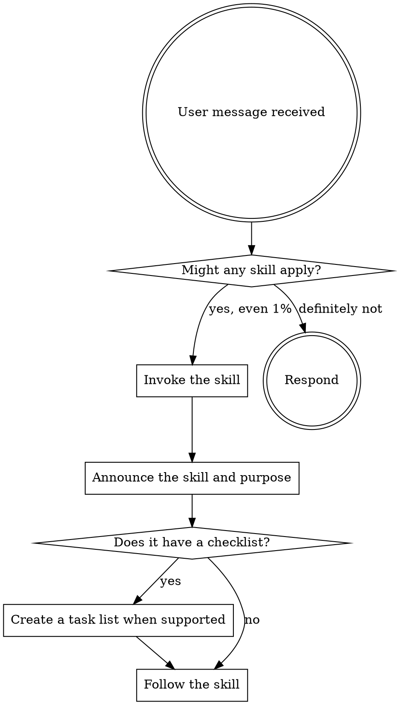

<EXTREMELY-IMPORTANT>
If you think there is even a 1% chance a skill might apply to what you are doing, invoke it first to check.

If a skill applies to the task, use it.
</EXTREMELY-IMPORTANT>

## How to Access Skills

Use your agent platform's supported skill mechanism. In Codex, invoke a skill explicitly with `$skill-name`, or allow Codex to select it from its description. In other environments, follow that platform's skill-loading documentation.

Do not manually reimplement a relevant skill's workflow instead of invoking it.

## Using Skills

### The Rule

Check for relevant or requested skills before any response or action. If an invoked skill turns out not to apply, continue without it.

## Red Flags

These thoughts mean stop and check for a skill:

| Thought | Reality |
|---|---|
| "This is just a simple question" | Questions are tasks. Check for skills. |
| "I need more context first" | Skill check comes before clarifying questions. |
| "Let me explore the codebase first" | Skills tell you how to explore. Check first. |
| "I can check files quickly" | Skills provide workflow context. Check first. |
| "This doesn't need a formal skill" | If a skill exists, use it. |
| "I remember this skill" | Skills evolve. Load the current version. |
| "This feels productive" | Undisciplined action wastes time. Skills prevent this. |

## Skill Priority

When multiple skills could apply, use this order:

1. **Process skills first** (for example, brainstorming or debugging) - these determine how to approach the work
2. **Implementation skills second** - these guide execution

"Let's build X" -> brainstorming first, then an implementation skill.

## Skill Types

**Rigid** skills (for example, TDD or debugging) require their workflow to be followed exactly.

**Flexible** skills provide patterns to adapt to the task.

## User Instructions

User instructions define what to do, not whether to skip applicable workflows.
